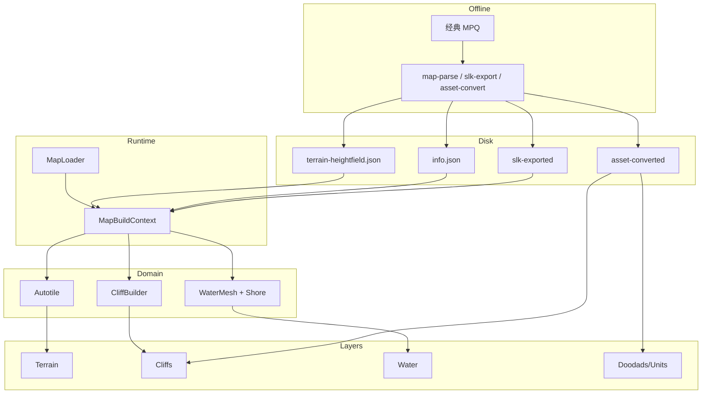

# MapRoot 架构设计

> 范围：`scenes/map/map_root.tscn` + `scripts/map/*` — Godot 侧如何把预解析地图数据变成可预览场景。  
> **分层总纲（优先）**：[LAYERED_ARCHITECTURE.md](docs/architecture/LAYERED_ARCHITECTURE.md)（Data / Catalog / Logic / Presentation / Editor）。  
> 编辑器如何复用本结构见 [EDITOR.md](docs/editor/EDITOR.md)。水体细节见 [WATER.md](docs/water/WATER.md)。悬崖见 [CLIFF.md](docs/cliff/CLIFF.md)（斜坡待重做）。  
> 路线图见 [ROADMAP.md](docs/roadmap/ROADMAP.md)。  
> 最后更新：2026-07-24

原则：**离线解析 → 数据驱动装配 → 节点树分层渲染**。数据与逻辑分离；Layer 只挂树，规则在 Domain。  
本文 §2 职责表为历史快照；与总纲冲突时以 [LAYERED_ARCHITECTURE.md](docs/architecture/LAYERED_ARCHITECTURE.md) 为准，并逐步搬迁。

---

## 1. 是否采用节点树分层？

**是。** `MapRoot` 是编排节点（`MapLoader`），子节点按渲染职责分 Layer；Domain（`Wc3*`）为无 Node 的构建器，不进场景树。

### 1.1 场景树

```text
MapRoot (Node3D)                    ← presentation/map_loader.gd
├── Terrain (Node3D)                ← layers/map_terrain_layer.gd
│   └── Ground (MeshInstance3D)     ← mesh/heightfield_mesh.gd
├── Cliffs (Node3D)                 ← layers/map_cliff_layer.gd
│   └── （运行时 MultiMeshInstance3D 子节点）
├── Ramps (Node3D)                  ← layers/map_ramp_layer.gd
├── Water (Node3D)                  ← layers/map_water_layer.gd
│   └── Surface (MeshInstance3D)    ← heightfield_mesh.gd
│   └── （运行时岸浪 MultiMesh / 粒子）
├── Doodads (Node3D)                ← layers/map_doodad_layer.gd
├── Units (Node3D)                  ← layers/map_unit_layer.gd
├── DebugGrid (Node3D)              ← layers/map_debug_grid_layer.gd
└── RampDebug (Node3D)              ← layers/map_ramp_debug_layer.gd
```

实例化位置：

| 场景 | 用法 |
| ------ | ------ |
| `scenes/main.tscn` | 预览 Lost Temple；`auto_load_on_ready=true`；可开 doodads / pathing 栅格 |
| `editor/scenes/editor_main.tscn` | `auto_load_on_ready=false`；关 doodads/units；开碰撞；由 `EditorApp` 喂内存 hf |

### 1.2 逻辑分层（依赖自上而下）

```text
Presentation（场景 Layer）
  MapLoader / Map*Layer / HeightfieldMesh / OrbitCamera
        │ 消费 Mesh / Transforms / placements
Application
  MapBuildContext（单次加载共享态）
        │
Domain（WC3 规则，RefCounted / static）
  Autotile / Cliff* / Water* / Shore* / Coords / Catalog / Tiles
        │
Infrastructure
  RuntimeAssets / MapModelCache / AssetProvider / Placeholders
```

命名约定：`Map*` ≈ 场景层，`Wc3*` ≈ Domain。文件目前仍平铺在 `scripts/map/`。

---

## 2. 脚本职责全表

### 2.1 Presentation / Application

| 文件 | 职责 | 手动干预时 |
| ------ | ------ | ------------ |
| `map_loader.gd` | 读 JSON/内存 hf；建 Context；按序调 Layer；export 开关；状态栏；碰撞；查看栅格 | 加载顺序、开关、泡沫 export、编辑器重建入口 |
| `map_build_context.gd` | 共享 `hf`/`meta`/`info`/`tiles`/`catalog`/`cache`；`ensure_cliff_topology()` 只算一次 | 往 Context 加共享字段 |
| `map_terrain_layer.gd` | Autotile → Ground mesh + `wc3_ground.gdshader`；`set_debug_grid` | 地面材质参数、栅格 uniform |
| `map_cliff_layer.gd` | CliffBuilder → MultiMesh + `wc3_cliff.gdshader` | 悬崖材质、调试栅格、分组策略 |
| `map_water_layer.gd` | WaterMesh + Shoreline + ShoreFoam | 水面/岸浪挂载、泡沫参数接收 |
| `map_doodad_layer.gd` | doodads.json → GLB / MultiMesh / 占位 | 装饰摆放阈值、阈值阈值 |
| `map_unit_layer.gd` | units.json → GLB / 占位 | 单位摆放（默认关） |
| `map_pathing_debug_layer.gd` | 把三级栅格转到 Terrain（与 Loader 栅格有重叠） | 见 §6 评估 |
| `heightfield_mesh.gd` | MeshInstance3D 薄封装 | 一般不用改 |
| `orbit_camera.gd` | 主场景预览相机 | 预览操作手感 |

### 2.2 Domain（`Wc3*`）

| 文件 | 职责 | 手动干预时 |
| ------ | ------ | ------------ |
| `wc3_coords.gd` | 坐标变换、`TILE_SIZE`/`WORLD_SCALE`、flags | 缩放、坐标系 |
| `heightfield_mesh_builder.gd` | `read_heightfield_meta`、`sample_vert` | hf 元数据字段 |
| `wc3_terrain_tile_catalog.gd` | tileID/cliffID → PNG、模型目录 | 贴图查找、悬崖模型路径 |
| `wc3_terrain_autotile.gd` | bitmask 地面网格、Texture2DArray | **改地面几何/留缝/斜坡甲板** |
| `wc3_cliff_tiles.gd` | TAG、斜坡、romp、GAP、`resolve_glb` | **悬崖判定/斜坡选型** |
| `wc3_cliff_builder.gd` | 收集悬崖/斜坡实例 transforms | **改实例放置/叠层** |
| `wc3_cliff_height_map.gd` | 悬崖 shader 高度纹理 | 崖面高度变形 |
| `wc3_water_params.gd` | Water.slk → 序列帧/深浅色 | 水体表参数 |
| `wc3_water_mesh.gd` | 水面 ArrayMesh | **改水面几何** |
| `wc3_shoreline_builder.gd` | 岸浪发射点 | **改岸浪位置算法** |
| `wc3_shore_foam.gd` | 岸浪 MultiMesh / 粒子近似 | **改岸浪视觉** |
| `wc3_id_catalog.gd` | 四字符 ID → SLK / GLB | 单位装饰模型路径 |

### 2.3 Infrastructure

| 文件 | 职责 | 手动干预时 |
| ------ | ------ | ------------ |
| `runtime_assets.gd` | 路径 resolve、load 贴图/图集 | 资源找不到、路径规则 |
| `map_model_cache.gd` | GLB 场景/网格缓存 | 模型实例化/动画 |
| `map_placeholders.gd` | 缺模灰盒 | 占位外观 |
| `addons/asset_provider/` | overlay → converted → slk-exported（**不读** `.cache`） | 资产优先级；见 [ASSET_LANES.md](ASSET_LANES.md) |

### 2.4 着色器

| 文件 | 用途 |
| ------ | ------ |
| `shaders/wc3_ground.gdshader` | 地表图集 + 调试栅格 |
| `shaders/wc3_cliff.gdshader` | 悬崖贴图 + 高度变形 + 栅格 |
| `shaders/wc3_water.gdshader` | 水面序列帧 |
| `shaders/wc3_shore_foam.gdshader` | 岸浪 Additive |
| `shaders/wc3_debug_grid.gdshaderinc` | 三级栅格 include |

---

## 3. 数据与逻辑分离

### 3.1 什么是「数据」

| 类别 | 位置 | 内容 |
| ------ | ------ | ------ |
| 地图 JSON | `assets/map-parsed/<slug>/` | 见 [MAP_DATA.md](docs/architecture/MAP_DATA.md)（`Wc3Heightfield` / `Wc3TileVertex`） |
| 表/文本数据 | `assets/slk-exported/` | SLK JSON + UnitFunc/UI txt（数据车道） |
| 转换资产 | `assets/asset-converted/` | PNG / GLB / `.scn` / PathTextures（视觉车道） |
| extract 中间态 | `.cache/wc3-assets/` | 仅工具；运行时禁止依赖（[ASSET_LANES.md](ASSET_LANES.md)） |
| 编辑器内存 | `MapDocument.hf` → `MapLoader._external_hf` | 与 JSON 同形，优先于磁盘 |

**heightfield 关键键：**

`tilepointWidth/Height`、`tileSize`、`centerOffset`、`heights`、`waterHeights`、`layerHeights`、`flagsPacked`、`groundTextures`/`groundVariations`、`cliffTextures`/`cliffVariations`、`groundTilesets`、`cliffTilesets`、`mainTileset`。

### 3.2 什么是「逻辑」

| 类型 | 例子 | 输出契约 |
| ------ | ------ | ---------- |
| Domain 纯计算 | Autotile / CliffBuilder / WaterMesh / Shoreline | `{ mesh }` / `{ groups[] }` / `{ placements[] }`，**不碰场景树** |
| Layer 实例化 | `Map*Layer.build` | 清空子节点、设材质、挂 MultiMesh |
| Application 编排 | `MapLoader._load_all` | 决定顺序与开关 |

**数据驱动含义：** 换地图 = 换 JSON（或编辑器改 `hf`）；换外观 = 换 SLK/PNG/GLB；规则代码尽量不写死某张图。

---

## 4. 数据加载流

```text
经典客户端 MPQ
    │ tools/mpq-extract
    ▼
.cache/wc3-assets/                    （原始 BLP/MDX/…）
    │ tools/asset-convert / slk-export / map-parse
    ▼
assets/
  map-parsed/<slug>/                  ← 地图 JSON（主输入）
  slk-exported/                       ← 表
  asset-converted/                    ← PNG/GLB + 同目录 .scn（convert → bake）
    │
    ▼ 运行时
MapLoader._ready()
  → Wc3TerrainTileCatalog.load_default()
  → [可选] Wc3IdCatalog.load_default()
  → [auto_load_on_ready] _load_all()
```

编辑器路径：不自动 `_load_all`；`EditorApp` 调用 `reload_from_hf(hf, info, map_dir)`，内部仍走 `_load_all`，但 hf 来自 `_external_hf`。



---

## 5. 逻辑调用流

### 5.1 全量加载 `_load_all`

```text
hf/info ← _external_* 或 _read_json(map_dir/…)
ctx ← MapBuildContext.create(map_dir, hf, info, tiles, catalog, cache)
ctx.ensure_cliff_topology()
  → Wc3CliffTiles.collect_ramp_placements / count_gaps
→ Terrain.build(ctx) → [可选 trimesh 碰撞]
→ Cliffs.build(ctx)          # build_cliffs
→ _apply_view_grid()
→ Water.build(ctx)           # build_water；同步 foam_* 
→ Units.build(units.json)    # place_units，默认 false
→ Doodads.build(doodads.json)# place_doodads，默认 true（编辑器关）
→ PathingDebug.build(ctx)    # show_pathing_debug_grid
```

### 5.2 编辑器三条重建

| API | 触发 | 范围 |
|-----|------|------|
| `reload_from_hf` | 新建/打开 | 完整 `_load_all` |
| `rebuild_terrain_only` | 仅地表笔刷 | Terrain + 碰撞 + 栅格 |
| `rebuild_terrain_cliffs_water` | 悬崖/水/坡笔刷 | Terrain + Cliffs + Water + 碰撞 + 栅格 |

调度在 `editor/scripts/editor_app.gd`：`_on_brush_rebuild` 看 `cliff_dirty`；`_apply_document` 全量或悬崖路径。

### 5.3 Domain → Layer 契约

| 系统 | Domain 入口 | Layer 消费 |
|------|-------------|------------|
| 地面 | `Wc3TerrainAutotile.build_ground_mesh` | `MapTerrainLayer.build` |
| 悬崖 | `Wc3CliffBuilder.collect_instances` | `MapCliffLayer.build` |
| 水面 | `Wc3WaterMesh.build` | `MapWaterLayer.build` |
| 岸浪 | `Wc3ShorelineBuilder.collect_foam_placements` → `Wc3ShoreFoam` | 同上 |
| 装饰/单位 | Catalog + Cache | `MapDoodadLayer` / `MapUnitLayer` 直接挂树 |

---

## 6. 手动干预速查

| 想改什么 | 去哪个脚本 |
|----------|------------|
| 地面三角形 / 悬崖留缝 / 斜坡甲板 | `wc3_terrain_autotile.gd` |
| 地面 shader、图集混合 | `shaders/wc3_ground.gdshader`、`map_terrain_layer.gd` |
| 悬崖是否出现、TAG、斜坡 romp | `wc3_cliff_tiles.gd`（策略/层高见 [CLIFF.md](docs/cliff/CLIFF.md)；斜坡待重做） |
| 悬崖放哪、叠几段、缺模警告 | `wc3_cliff_builder.gd` |
| 编辑器崖笔刷 / 异种同化 B | `editor/scripts/map_document.gd` |
| 悬崖 MultiMesh / 贴图 / 立面栅格 | `map_cliff_layer.gd`、`wc3_cliff.gdshader` |
| 悬崖高度纹理 | `wc3_cliff_height_map.gd` |
| 水面格子几何 | `wc3_water_mesh.gd` |
| 岸浪落点 | `wc3_shoreline_builder.gd` |
| 岸浪样子 | `wc3_shore_foam.gd`、`wc3_shore_foam.gdshader` |
| 岸浪微调滑条 | `map_loader.gd` 的 `foam_*` export |
| tile / cliff 贴图路径 | `wc3_terrain_tile_catalog.gd` |
| 单位/装饰 GLB 路径 | `wc3_id_catalog.gd` |
| 坐标与世界缩放 | `wc3_coords.gd` |
| 加载开关与顺序 | `map_loader.gd` |
| 资源找不到 | `runtime_assets.gd`、`addons/asset_provider/` |
| 编辑器笔刷/文档 | `editor/scripts/map_document.gd`、`terrain_brush.gd`（见 EDITOR.md） |
| 调试栅格（编辑器菜单） | `MapLoader.set_view_grid_level` → `_apply_view_grid` |

---

## 7. 设计评估

### 7.1 做得好的地方

- **节点树分层清晰**：Terrain / Cliffs / Water / Doodads / Units 一眼可懂  
- **数据驱动**：换图不改代码；编辑器与预览共用同一套 Layer  
- **Domain 不碰场景树**：便于单测与 headless  
- **MapBuildContext**：悬崖拓扑只算一次，避免各层重复扫图  
- **分路径重建**：编辑器地表笔刷不必每次重建悬崖  

### 7.2 冗余 / 复杂 / 不合理

| 问题 | 说明 |
|------|------|
| **调试栅格双通路** | `MapLoader._apply_view_grid` 与 `MapPathingDebugLayer` 功能重叠；主场景靠后者，编辑器靠前者，易互相覆盖 |
| **Layer API 不一致** | Terrain/Cliff/Water 用 `build(ctx)`；Doodad/Unit 用 `build(json)`，未吃 Context |
| **ensure_cliff_topology 调用点多** | Loader 与部分 Layer 都会调（靠 `_cliff_ready` 防重算），读起来像重复 |
| **泡沫参数三层传递** | Loader export → WaterLayer → ShoreBuilder/Foam 常量，调参入口分散 |
| **目录未归位** | 25 个文件平铺 `scripts/map/`，逻辑分层在命名里，不在文件夹里 |
| **PathingDebug 价值偏低** | 几乎只是转发 `set_debug_grid`，与 Loader 重复 |
| **悬崖笔刷仍全量刷地面** | `rebuild_terrain_cliffs_water` 每次重跑 `Terrain.build`，大图可能偏慢 |

### 7.3 重构思路与优先级

| 优先级 | 项 | 做法 |
|--------|----|------|
| **P0** | 统一调试栅格 | 以 `MapLoader.set_view_grid_level` 为唯一入口；瘦化或删除 `MapPathingDebugLayer` |
| **P0** | 文档与默认值对齐 | 已写清 `place_units=false`、编辑器 `auto_load_on_ready=false` |
| **P1** | 统一 Layer 契约 | Doodad/Unit 改为 `build(ctx)`；JSON 由 Loader/Context 预解析 |
| **P1** | Pipeline 配置化 | `_load_all` 步骤表 `{ id, enabled, build }`，便于单层开关与测试 |
| **P1** | 泡沫参数单源 | `Wc3WaterBuildOptions` 或挂在 Context 上，去掉字段拷贝 |
| **P2** | 目录归位 | `app/` `layers/` `domain/` `infra/` `view/`（可用 `class_name` 减路径痛） |
| **P2** | 更细重建粒度 | 悬崖笔刷可只重建 Cliffs+Water（地面 mesh 不变时跳过 Autotile） |
| **P2** | Domain 输出结构化 | TypedDict / 小 RefCounted，代替松散 Dictionary |

**建议暂缓：** 运行时直接读 MPQ、Domain 迁 GDExtension、合并全部 `Wc3Cliff*` 成上帝类。

---

## 8. 相关文档

| 文档 | 内容 |
|------|------|
| [EDITOR.md](docs/editor/EDITOR.md) | 地图编辑器 Presentation 架构 |
| [CLIFF.md](docs/cliff/CLIFF.md) | 直崖数据、策略 B、层高与回归 |
| [ROADMAP.md](docs/roadmap/ROADMAP.md) | MapRoot + Editor 开发路线 |
| [WATER.md](docs/water/WATER.md) | 水体与岸浪 |
| [TODO.md](docs/roadmap/TODO.md) | 具体缺陷清单（斜坡等） |
| [WC3_ASSET_PATHS.md](docs/data/WC3_ASSET_PATHS.md) | 经典资产路径 |
| [LEGAL.md](docs/data/LEGAL.md) | 资产合规 |
